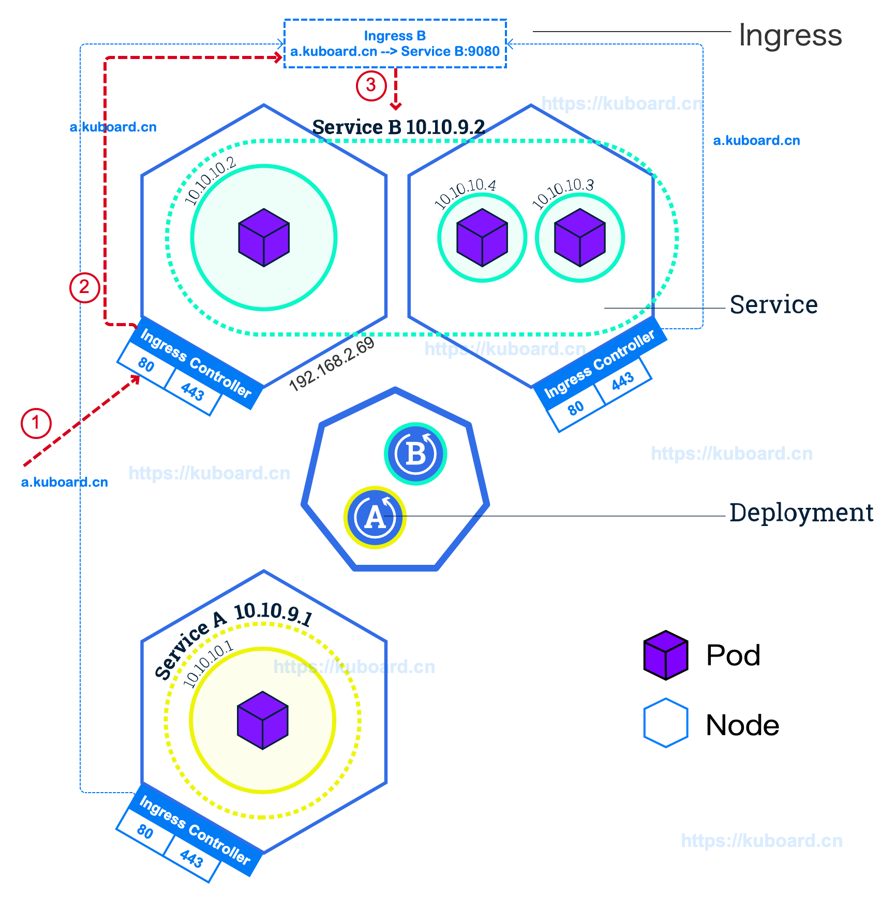

###  Ingress

Ingress 是 Kubernetes 的一种 API 对象，将集群内部的 Service 通过 HTTP/HTTPS 方式暴露到集群外部，并通过规则定义 HTTP/HTTPS 的路由。Ingress 具备如下特性：集群外部可访问的 URL、负载均衡、SSL Termination、按域名路由（name-based virtual hosting）。

Ingress Controller （通常需要负载均衡器配合）负责实现 Ingress API 对象所声明的能力。如下图所示：

1. Ingress Controller 监听所有 worker 节点上的 80/443 端口
2. Ingress Controller 将所有对域名为 a.kuboard.cn 的 HTTP/HTTPS 请求路由到 Service B 的 9080 端口
3. Service B 将请求进一步转发到其标签所选择的 Pod 容器组（通过 targetPort 指定容器组上的端口号）

该图中，**请求被转发的过程为：**

1. 假设您将 a.kuboard.cn 的 DNS 解析到了集群中的一个 worker 节点的 IP 地址 `192.168.2.69`。（如果您的 worker 节点有外网地址，请使用外网地址，这样您可以从外网访问您的服务）。
2. 从客户端机器执行命令 `curl http://a.kuboard.cn/abc/`，该请求您将被转发到 `192.168.2.69` 这个地址的 80 端口，并被 Ingress Controller 接收。
3. Ingress Controller 根据请求的域名 `a.kuboard.cn` 和路径 `abc` 匹配集群中所有的 Ingress 信息，并最终找到 `Ingress B` 中有这个配置，其对应的 Service 为 `Service B` 的 `9080` 端口。
4. Ingress Controller 通过 kube-proxy 将请求转发到 `Service B` 对应的任意一个 Pod 上 与 `Service B` 的 `9080` 端口对应的容器端口上。（从 Ingress Controller 到 Pod 的负载均衡由 kube-proxy + Service 实现）。



### Ingress Controller

 如上所述，您必须在 Kubernetes 集群中安装了 Ingress Controller，您配置的 Ingress 才能生效。 

```
	Ingress 只是 Kubernetes 中的一种配置信息；Ingress Controller 才是监听 80/443 端口，并根据 Ingress 上配置的路由信息执行 HTTP 路由转发的组件。
```

 Ingress Controller 有多种实现可供选择，请参考 Kubernetes 官方文档 [Additional controllers](https://kubernetes.io/docs/concepts/services-networking/ingress-controllers/#additional-controllers)，比较常用的有 [Traefic](https://github.com/containous/traefik) 、 [Nginx Ingress Controller for Kubernetes](https://www.nginx.com/products/nginx/kubernetes-ingress-controller) 等。 

 如果您参考 https://kuboard.cn 网站上提供的文档安装了 Kubernetes，您应该已经完成了 [Nginx Ingress Controller for Kubernetes](https://www.nginx.com/products/nginx/kubernetes-ingress-controller) 在您 Kubernetes 集群中的安装。该 Ingress Controller 以 DaemonSet 的类型部署到 Kubernetes，且监听了 hostPort 80/443，YAML 片段如下所示： 

```yaml
apiVersion: extensions/v1beta1
kind: DaemonSet
metadata:
  name: nginx-ingress
  namespace: nginx-ingress
	# ...
spec:
  selector:
    matchLabels:
      app: nginx-ingress
  template:
    metadata:
      labels:
        app: nginx-ingress
    spec:
      serviceAccountName: nginx-ingress
      containers:
      - image: nginx/nginx-ingress:1.5.3
        name: nginx-ingress
        ports:
        - name: http
          containerPort: 80
          hostPort: 80
        - name: https
          containerPort: 443
          hostPort: 443

```

**TIP**

- Ingress Controller 并非只能监听 80/443 端口，您可以根据自己网络拓扑的需要，选择合适的端口
- 根据您安装 Ingress Controller 的方式不同，您的 Ingress Controller 并不一定监听了所有 worker 节点的 80/443 端口（本教程不涉及此主题）
- 您也可以在 Kubernetes 集群中安装多种 Ingress Controller，请参考 [Using multiple Ingress controllers](https://kubernetes.io/docs/concepts/services-networking/ingress-controllers/#using-multiple-ingress-controllers)

### 融入到网络拓扑中

如前所述，Kubernetes Ingress 只能监听到节点的 80/443 端口，且 Ingress 可以完成 L7 路由的功能。由于 Kubernetes Ingress 配置更便捷，推荐使用 Kubernetes Ingress 替代常规的互联网应用架构中的 Nginx 反向代理。那么，如何使部署在内网的 Kubernetes 集群上的 Ingress Controller 的 80/443 端口可以在外网访问到呢？

本教程推荐如下两种做法，结合您自己对安全性、可靠性等因素的考量，您可以演化出适合自己的拓扑结构。

#### 暴露单worker节点

如下图所示，暴露单个 worker 节点的步骤如下：

- 为您 Kubernetes 集群中的某一个 worker 节点配置外网 IP 地址 Z.Z.Z.Z
- 将您在 Ingress 中使用到的域名（假设是`a.demo.kuboard.cn`）解析到该外网 IP 地址 Z.Z.Z.Z
- 设置合理的安全组规则（开放该外网 IP 地址 80/443 端口的入方向访问）

> 文档 [安装 Kubernetes 单Master节点](https://kuboard.cn/install/install-k8s.html) 中使用的就是这种拓扑结构。这种方式下，Ingress Controller 存在单点故障的可能性。


#### 使用外部负载均衡器

如下图所示，使用外部负载均衡器的步骤如下：

- 创建一个集群外部的负载均衡器，该负载均衡器拥有一个外网 IP 地址 Z.Z.Z.Z，并监听 80/443 端口的 TCP 协议
- 将负载均衡器在 80/443 端口上监听到的 TCP 请求转发到 Kubernetes 集群中所有（或某些）worker 节点的 80/443 端口，可开启按源IP地址的会话保持
- 将您在 Ingress 中使用到的域名（假设是`a.demo.kuboard.cn`）解析到该负载均衡器的外网 IP 地址 Z.Z.Z.Z

> 文档 [安装 Kubernetes 高可用](https://kuboard.cn/install/install-kubernetes.html) 中使用的就是这种拓扑结构。

